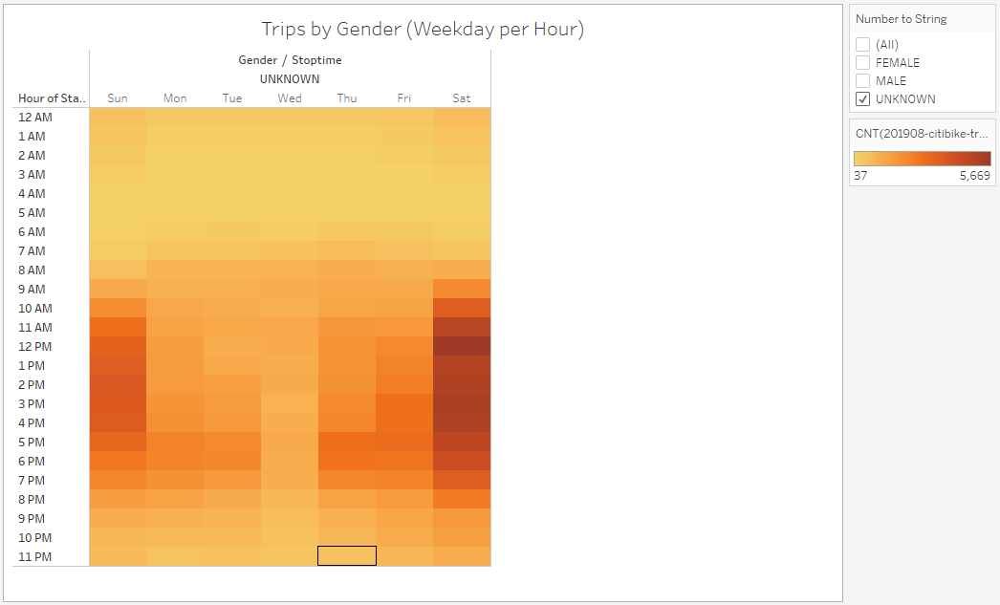

# Citi Bike Rides in NYC

## Overview of the Statistical Analysis

This study analyzed the data of the Citi Bike Rides and visualized the results using Tableau.

## Results

- Checkout times peaks at 5 minutes. 

- Checkout times trends the same for MALE and FEMALE.

- Bike usage differs between workdays and weekends. On workdays, bike usage is high during the rush hours. However, on weekends, the usage is evenly distributed during the daytime. It suggests that bikes are most likely used for commute on the workdays and leisure on the weekends.

- Bike usage on workdays and weekends differs the same for male and female bikers.

- Subscribers ride more on workdays than on weekends. Subscribers use bikes mostly for commute. Therefore, this group of customers requires access to bikes through subscription.

- Customers ride more on weekends than on workdays. Non-subscribing customers use bikes on weekends for leisure. Their usage is mostly spontaneous. Therefore, this group of customers do not subscribe.

- Additional observations on non-subscribing customers. Non-subscribing customers are presumably identified as "UNKNOWN" gender since their customer information is usually imcomplete. Non-subscribing customers use bikes mostly on weekends for leisure. Their checkout times peaks between 10 to 25 minutes.

## Summary

- Bike usage VS. locations
   
  The above results analyzed bike usage by time, gender and customer type. Based on the separation in time, two types of usage are identified, which are commute and leisure. Further analysis is needed to analyze the usage based on locations. If bike usage is separated in locations between commute and leisure, it can be beneficial to transport bikes between locations.

- Bike usage VS. seasons
   
  It would be interesting to find out how bike usage changes with seasons. It has been discovered bike usage differs between workdays and weekends. It is likely that usage fluctuates with seasons.
